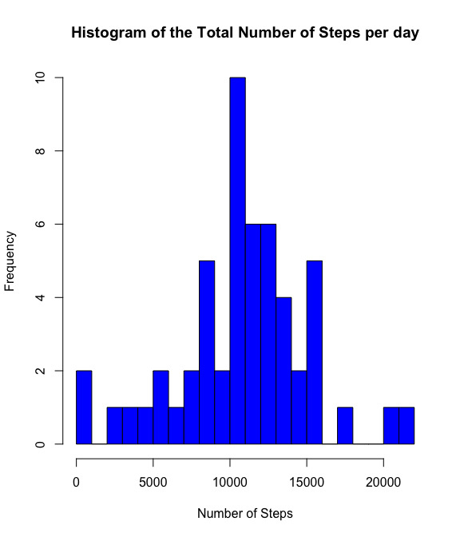
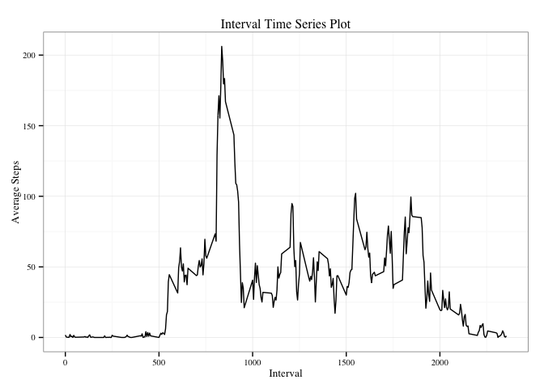
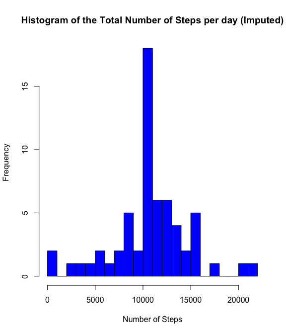
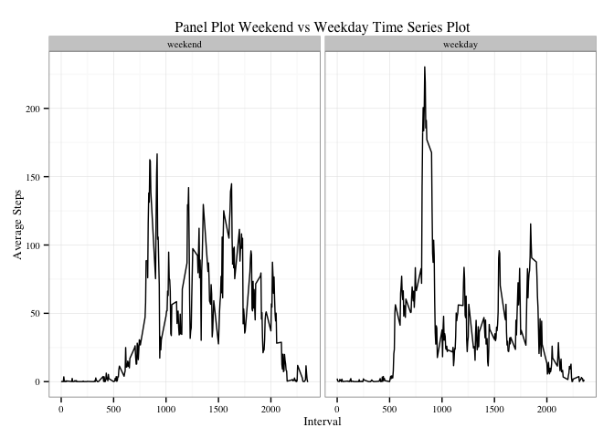

# Reproducible Research: Peer Assessment 1
Heng Rui Jie  
16th September 2015  

## 0. Setting Global Options and Loading required libraries
Here, we first set the global option for both codes and output to
be displayed

```r
library(knitr)
library(xtable)
library(dplyr)
```

```
## 
## Attaching package: 'dplyr'
## 
## The following objects are masked from 'package:stats':
## 
##     filter, lag
## 
## The following objects are masked from 'package:base':
## 
##     intersect, setdiff, setequal, union
```

```r
library(ggplot2)
opts_chunk$set(echo=TRUE, results="show" )
```

## 1.0 Loading and Preprocessing the data

This portion extracts the data from the working directory.  
After unzipping the file, the data is read into R using read.csv

### 1.1 Loading Data: Unzipping and Summary Output


```r
setwd("/Users/kilopy82/GitHub/RepData_PeerAssessment1")
unzip("activity.zip")
rawdata <- read.csv(file="activity.csv", header = TRUE, stringsAsFactors = FALSE)
summary(rawdata)
```

```
##      steps            date              interval     
##  Min.   :  0.00   Length:17568       Min.   :   0.0  
##  1st Qu.:  0.00   Class :character   1st Qu.: 588.8  
##  Median :  0.00   Mode  :character   Median :1177.5  
##  Mean   : 37.38                      Mean   :1177.5  
##  3rd Qu.: 12.00                      3rd Qu.:1766.2  
##  Max.   :806.00                      Max.   :2355.0  
##  NA's   :2304
```

### 1.2 Preprocessing Data
Next, we transform the date column from character to proper date type


```r
mainData <- transform(rawdata, date = as.Date(date, "%Y-%m-%d"))
```

## 2.0 What is mean total number of steps taken per day?

### 2.1 Calculate the Total Number of Steps Taken per day
To compute the total number of steps taken per day, we aggregate the steps per date using sum. The table is printed as follows.  


```r
data1 <- select(mainData, steps, date)
bydate <- list(factor(data1$date))
result1 <- aggregate(x=data1$steps, by=bydate, FUN=sum)
colnames(result1) <- c("Dates" , "Steps")
result1
```

```
##         Dates Steps
## 1  2012-10-01    NA
## 2  2012-10-02   126
## 3  2012-10-03 11352
## 4  2012-10-04 12116
## 5  2012-10-05 13294
## 6  2012-10-06 15420
## 7  2012-10-07 11015
## 8  2012-10-08    NA
## 9  2012-10-09 12811
## 10 2012-10-10  9900
## 11 2012-10-11 10304
## 12 2012-10-12 17382
## 13 2012-10-13 12426
## 14 2012-10-14 15098
## 15 2012-10-15 10139
## 16 2012-10-16 15084
## 17 2012-10-17 13452
## 18 2012-10-18 10056
## 19 2012-10-19 11829
## 20 2012-10-20 10395
## 21 2012-10-21  8821
## 22 2012-10-22 13460
## 23 2012-10-23  8918
## 24 2012-10-24  8355
## 25 2012-10-25  2492
## 26 2012-10-26  6778
## 27 2012-10-27 10119
## 28 2012-10-28 11458
## 29 2012-10-29  5018
## 30 2012-10-30  9819
## 31 2012-10-31 15414
## 32 2012-11-01    NA
## 33 2012-11-02 10600
## 34 2012-11-03 10571
## 35 2012-11-04    NA
## 36 2012-11-05 10439
## 37 2012-11-06  8334
## 38 2012-11-07 12883
## 39 2012-11-08  3219
## 40 2012-11-09    NA
## 41 2012-11-10    NA
## 42 2012-11-11 12608
## 43 2012-11-12 10765
## 44 2012-11-13  7336
## 45 2012-11-14    NA
## 46 2012-11-15    41
## 47 2012-11-16  5441
## 48 2012-11-17 14339
## 49 2012-11-18 15110
## 50 2012-11-19  8841
## 51 2012-11-20  4472
## 52 2012-11-21 12787
## 53 2012-11-22 20427
## 54 2012-11-23 21194
## 55 2012-11-24 14478
## 56 2012-11-25 11834
## 57 2012-11-26 11162
## 58 2012-11-27 13646
## 59 2012-11-28 10183
## 60 2012-11-29  7047
## 61 2012-11-30    NA
```

### 2.2 Make a histogram of the total number of steps taken each day
Taking the result from the previous code chunk, the histogram of the Total number of steps per day is plotted below.


```r
hist(result1$Steps, breaks= 20 , main = "Histogram of the Total Number of Steps per day", ylab = "Frequency" , xlab = "Number of Steps" , col = 'blue')
```

 

### 2.3 Calculate and report the mean and median of the total number of steps taken per day


```r
mean1 <- as.character(round(mean(result1$Steps, na.rm = TRUE),1))
median <- median(result1$Steps, na.rm = TRUE)
```

The calculated mean for the total number of steps take per day is **10766.2** while the calculated median is **10765**

## 3.0 What is the average daily activity pattern?

### 3.1 Make a time series plot of the 5-minute interval

The time series plot based on the interval is plotted below:


```r
data2 <- select(mainData, steps, interval)
byInterval <- list(factor(data2$interval))
result2 <- aggregate(x=data2$steps, by=byInterval, FUN=mean, na.rm = TRUE)
colnames(result2) <- c("Interval" , "Steps")
result2 <- mutate(result2, Interval = as.numeric(levels(result2$Interval)))

g2 <- ggplot(data = result2, aes(x=Interval, y=Steps))
p2 <- g2 + geom_line() + theme_bw(base_family = "Times" , base_size = 10) +
  labs(x = "Interval", y = "Average Steps" , title = "Interval Time Series Plot")
p2
```

 
    
### 3.2 Which 5-minute interval, on average across the days in the dataset, contains the maximum number of steps?


```r
maxSteps <- filter(result2, result2$Steps == max(result2$Steps))
answer2 <- maxSteps$Interval
```

The 5-minute interval with the highest average is **835**.

## 4.0 Imputing missing values

### 4.1 Calculate and report the total number of missing values in the dataset

```r
missingValue <- nrow(mainData[is.na(mainData$steps) ,])
```

The total number of missing values is **2304**.

### 4.2 Devise a strategy for filling up the missing value
For imputation, we will first calculate the mean of the 5-minute interval  
across all the days. We will then use the caluclated value to impute the missing NA values.  


```r
data3 <- select(mainData, steps, interval)
byInterval3 <- list(factor(data3$interval))
meanResult3 <- aggregate(x=data3$steps, by=byInterval3, FUN=mean, na.rm = TRUE)
colnames(meanResult3) <- c("Interval" , "Steps")

result3 <- merge(x=mainData, y=meanResult3, by.x ="interval", by.y = "Interval", all.x =TRUE)
result3 <- mutate(result3, steps = ifelse(is.na(result3$steps), result3$Steps, result3$steps))
```

### 4.3 Create a new dataset with the missing value imputed


```r
result3 <- select(result3, interval, steps, date)
summary(result3)
```

```
##     interval          steps             date           
##  Min.   :   0.0   Min.   :  0.00   Min.   :2012-10-01  
##  1st Qu.: 588.8   1st Qu.:  0.00   1st Qu.:2012-10-16  
##  Median :1177.5   Median :  0.00   Median :2012-10-31  
##  Mean   :1177.5   Mean   : 37.38   Mean   :2012-10-31  
##  3rd Qu.:1766.2   3rd Qu.: 27.00   3rd Qu.:2012-11-15  
##  Max.   :2355.0   Max.   :806.00   Max.   :2012-11-30
```

### 4.4 Make a Histogram for the new dataset based on total number of steps taken each day

For this, the number of steps would need to be summed up at each day prior  
to the creation of the histogram


```r
bydate3 <- list(factor(result3$date))
result3_1 <- aggregate(x=result3$steps, by=bydate3, FUN=sum)
colnames(result3_1) <- c("Dates" , "Steps")

hist(result3_1$Steps, breaks= 20 , main = "Histogram of the Total Number of Steps per day (Imputed)", ylab = "Frequency" , xlab = "Number of Steps" , col = 'blue')
```

 

### 4.5 Calculate and report the Mean and Median for the new dataset


```r
mean4 <- as.character(round(mean(result3_1$Steps),1))
median4 <- as.character(round(median(result3_1$Steps),1))
```

The calculated mean for the imputed dataset **10766.2** while the calculated median is **10766.2**

Compared to the 1st part of the assignment, only the mean values remain the same after imputation. This is expected as the imputation for missing values used the average value, hence, the overall mean remains the same. However, the median has shifted as the previously missing values are now imputed with some values, hence the halfway point of
the imputed dataset will be adjusted accordingly. 


## 5.0 Are there differences in activity patterns between weekdays and weekends?

### 5.1 Create a new factor variable with two levels "weekday" and "weekend"


```r
result4 <- result3
result4$day <- weekdays(result4$date)
wdays <- c('Monday', 'Tuesday', 'Wednesday', 'Thursday', 'Friday')
result4$wDay <- factor( (result4$day %in% wdays), levels=c(FALSE, TRUE), labels = c('weekend','weekday') )
```

### 5.2 Make a panel plot contain a time series of the 5-minute interval


```r
result4_1 <- aggregate(formula = steps ~ interval + wDay, data = result4 , FUN="mean")
result4_1 <- mutate(result4_1, round(steps, 3))

g5 <- ggplot(result4_1, aes(x=interval, y=steps))
p5 <- g5 + geom_line() + facet_grid(. ~ wDay)
p5 <- p5 + theme_bw(base_family = "Times" , base_size = 10) +
  labs(x = "Interval", y = "Average Steps" , title = "Panel Plot Weekend vs Weekday Time Series Plot")
p5
```

 

Based on the above Panel Plot, it does suggest that there are differences in activities patttern. The maximum average number of steps made are higher over the weekdays as compared to the weekend. 
